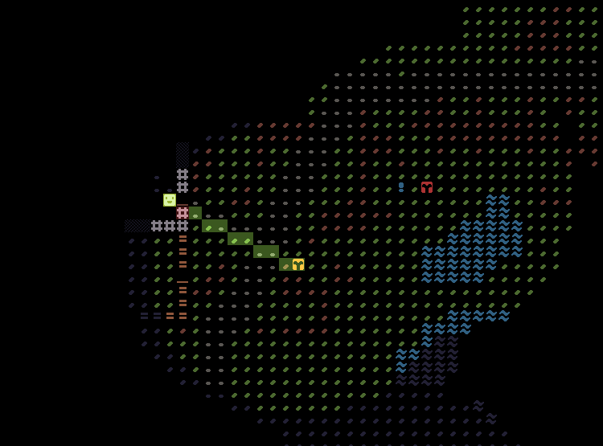

# On The Roadside

  

On the Roadside is a turnbased strategy game. It is developed by [@rm-code](https://twitter.com/rm_code) using [Lua](http://www.lua.org/) and the [LÖVE](https://love2d.org/) framework.

## Controls

| Key       | Action                     |
|-----------|----------------------------|
| Left      | Select previous fire mode  |
| Right     | Select next fire mode      |
| s         | Stand                      |
| c         | Crouch                     |
| p         | Prone                      |
| r         | Reload Weapon              |
| a         | Switch to Attack Mode      |
| m         | Switch to Movement Mode    |
| e         | Switch to Interaction Mode |
| i         | Open Inventory             |
| Backspace | Select previous Character  |
| Space     | Select next Character      |
| Return    | End Turn                   |
